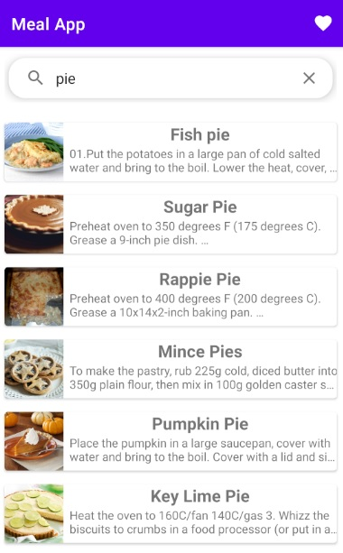
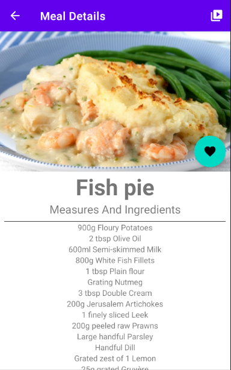

# Mealapp

Application with a clean architecture this built with
 - MVVM
 - Extension Functions
 - Retrofit
 - Room Database
 - Navigation Components
 - ViewBinding
 - Coroutines 

# Get it on Google PlayStore
 
 
 
 #Architecture
 
 

# Screen

